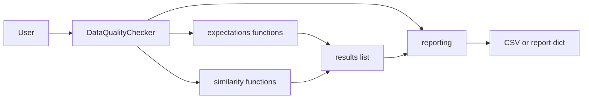

# Data Quality Package — Architecture

## Overview

The codebase is split into a small package `data_quality` with four modules plus a facade class. No extra abstractions: expectations and similarity are plain functions that take `(df, results, ...)` and append to `results`. The checker holds state and delegates.

## Module roles

- **utils** — Pure helpers: `normalize_columns`, `levenshtein_distance`, `levenshtein_ratio`, `classify_data_type`, `calculate_quality_scores`, `is_critical_data_element`. No dependency on other package modules.
- **expectations** — Single- and multi-column expectation functions; each appends one result dict to `results`. Uses `utils.normalize_columns`.
- **similarity** — Levenshtein analysis and summary/detail helpers; append to or read from `results`. Uses `utils` for Levenshtein.
- **reporting** — `get_comprehensive_results`, `save_comprehensive_results_to_csv`, `save_field_summary_to_csv`, `flatten_comprehensive_results`. All take `(df, results, dataset_name, user_specified_critical_columns, ...)`. Use `utils` for classify/quality/critical.
- **checker** — `DataQualityChecker`: holds `df`, `dataset_name`, `user_specified_critical_columns`, `results`. Methods call into expectations, similarity, and reporting; `run_rules_from_json` stays on the checker.

## Data flow

## Imports

- `utils` has no internal package imports.
- `expectations` and `similarity` import `utils`.
- `reporting` imports `utils`.
- `checker` imports `expectations`, `similarity`, `reporting`.

No cycles.

## Multi-environment

Designed to run on a local PC and on Databricks with the same code. Dependencies are standard library + pandas (and numpy for similarity). All file paths are passed in (e.g. `csv_filename`); use a path valid in your environment (e.g. `/dbfs/FileStore/...` on Databricks).
