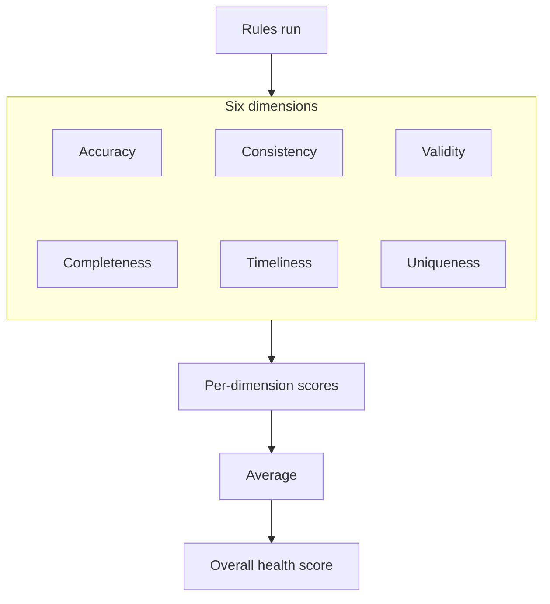
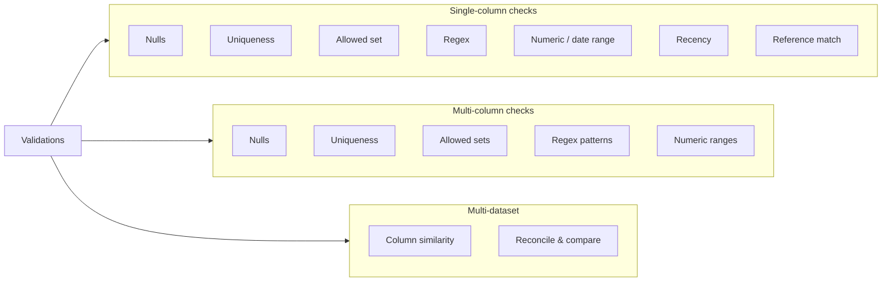
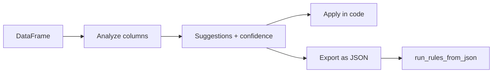
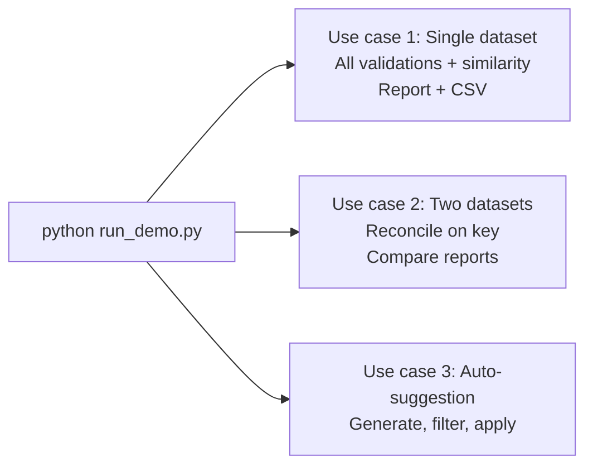
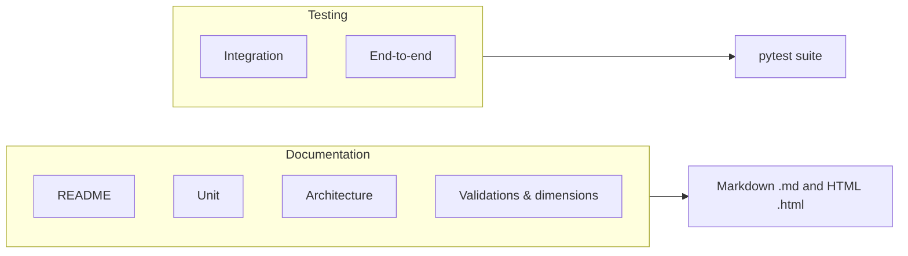

# Data Quality Tool Walkthrough

This walkthrough highlights what was accomplished when modularizing the data quality checker: package structure, dimensions, validations, demos, documentation, testing, and portability.

---

## 1. Before → After: Modularization

We started from a single script (`data_quality_checker.py`). The logic is now organized into a **package** (`data_quality/`) with clear modules so the code is easier to maintain, test, and extend. The way you use the library from Python is unchanged.

**Before → After:**

<div class="mod-diagram">
  <div class="mod-diagram-group mod-diagram-group-top">
    <div class="mod-diagram-row mod-diagram-row-top">
      <div class="mod-diagram-box">
        <strong>Single script</strong><br>
        <code>data_quality_checker.py</code>
      </div>
      <span class="mod-diagram-arrow">modularize →</span>
      <div class="mod-diagram-box">
        <strong>Package</strong><br>
        <code>data_quality/</code>
      </div>
    </div>
  </div>
  <div class="mod-diagram-connector">↓</div>
  <div class="mod-diagram-group mod-diagram-group-bottom">
    <div class="mod-diagram-row mod-diagram-row-modules">
      <div class="mod-diagram-module">utils</div>
      <div class="mod-diagram-module">expectations</div>
      <div class="mod-diagram-module">similarity</div>
      <div class="mod-diagram-module">reporting</div>
      <div class="mod-diagram-module">checker</div>
      <div class="mod-diagram-module">suggestion</div>
      <div class="mod-diagram-module">comparison</div>
    </div>
  </div>
</div>

**Package layout:**

- **utils.py** — Helpers (normalize columns, Levenshtein, classify data type, quality scores).
- **expectations.py** — All validation rules; each appends one result to a shared list.
- **similarity.py** — Levenshtein analysis and summary helpers.
- **reporting.py** — Build comprehensive results and save to CSV.
- **suggestion.py** — Auto-generate validation suggestions from dataframe analysis.
- **comparison.py** — Reconcile two datasets on a key and compare reports.
- **checker.py** — `DataQualityChecker` holds state and calls into the above.

**See the full picture:** [ARCHITECTURE.html](ARCHITECTURE.html) — module roles and data flow diagram.

---

## 2. Data Quality Dimensions & Health Score

Six standard **dimensions** are used to tag every rule and to compute an overall health score:

| Dimension       | Meaning |
|-----------------|--------|
| **Accuracy**    | Data correctly represents the real-world object or event. |
| **Completeness**| All required data is present. |
| **Consistency** | Data is uniform across systems and datasets (e.g. column similarity). |
| **Timeliness**  | Data is available when needed and up to date. |
| **Validity**    | Data conforms to defined formats, rules, or constraints. |
| **Uniqueness**  | No unintended duplicates exist. |

Each rule is tagged with one dimension. The **overall health score** is the average of **per-dimension scores** for dimensions that have at least one rule in the current run.

**How the health score is computed:**



**Reference:** [VALIDATIONS_AND_DIMENSIONS.md](VALIDATIONS_AND_DIMENSIONS.md) — dimensions table and full validations list.

---

## 3. Validations (Expectations) & Auto-Suggestions

The library supports **validations** (expectations) at three levels: **single-column** (one column at a time), **multi-column** (multiple columns together), and **multi-dataset** (reconciliation, same-rules comparison, and column similarity across datasets). The checker delegates to `expectations.py`, `similarity.py`, and `comparison.py`.

**Validation types at a glance:**



**Auto-suggestion** (in `suggestion.py`) analyzes a DataFrame and suggests validations with confidence scores. You can apply them in code or export as JSON and run them via `run_rules_from_json`.

**Auto-suggestion flow:**



Example: generate and review suggestions, then apply high-confidence ones:

```python
from data_quality import DataQualityChecker

checker = DataQualityChecker(df, dataset_name="My Dataset")
suggestions = checker.generate_suggestions()
high_confidence = [s for s in suggestions if s["confidence"] > 0.8]
checker.apply_suggestions(high_confidence)
```

**Full list of validations and definitions:** [VALIDATIONS_AND_DIMENSIONS.md](VALIDATIONS_AND_DIMENSIONS.md).

---

## 4. Demos & Runnable Examples

A structured **demo** runs through all validations and comparison features. From the project root:

```bash
python run_demo.py
```

**What the demo runs:**



It covers three use cases:

1. **Single dataset, all validations** — Every expectation type and similarity check on one dataset; report printed and saved to `data/demo_quality_report.csv`.
2. **Comparing two datasets** — Reconciliation on a key column and same-rules report comparison between two datasets.
3. **Auto-suggestion** — Generate suggestions, filter by confidence, and apply them.

To list every dimension and validation with short definitions (no data run):

```bash
python run_demo.py --list-validations
```

**Lighter examples:** `quick_start_example.py` and `run_analysis.py` show minimal usage.

**Full usage and options:** [README.html](README.html) and [USAGE.html](USAGE.html).

---

## 5. Documentation & Testing

**What’s available:**



**Documentation**

Docs are available in **Markdown** (`.md`):

- **README** — Overview, install, quick start, what you can do; see USAGE for full functionality and use.  
  → [README.md](README.md)
- **USAGE** — Full functionality and use: dimensions, validations list, JSON config, auto-suggestions, comparing datasets, pipeline, test suite, modularization.  
  → [USAGE.md](USAGE.md)
- **Architecture** — Module roles, data flow (with diagram), imports, multi-environment notes.  
  → [ARCHITECTURE.md](ARCHITECTURE.md)
- **Validations & dimensions reference** — Every dimension and validation with definitions.  
  → [VALIDATIONS_AND_DIMENSIONS.md](VALIDATIONS_AND_DIMENSIONS.md)

**Testing**

The test suite lives in `tests/` and uses **pytest**. Coverage includes:

- **Unit tests** — Utils, expectations, similarity, suggestion, checker, reporting.
- **Integration tests** — Reporting CSV output, cross-dataset comparison.
- **End-to-end** — Full checker flow and suggestion workflow (marked `e2e`).

Run the full suite (verbose):

```bash
pytest tests/ -v
```

Faster run (exclude end-to-end):

```bash
pytest tests/ -v -m "not e2e"
```

---

## 6. Portability

The library is designed and tested for **portability** across Python versions and target platforms. All file paths are passed in (e.g. CSV output paths), so you can use paths valid in your environment.

**Python versions:** Tested across multiple Python versions (see `pyproject.toml` for the supported range; typically 3.8+).

**Target platforms:** The same code has been tested on:

<div class="port-diagram">
  <div class="port-diagram-group">
    <div class="port-diagram-row">
      <div class="port-platform">
        <strong>Local PC</strong><br>
        <span class="port-desc">Development &amp; CI, pytest</span>
      </div>
      <div class="port-platform">
        <strong>Databricks</strong><br>
        <span class="port-desc">Notebooks &amp; jobs</span>
      </div>
      <div class="port-platform">
        <strong>Splunk</strong><br>
        <span class="port-desc">Scripts &amp; lookups</span>
      </div>
    </div>
  </div>
</div>

- **Local PC** — Development and CI (e.g. pytest on your machine).
- **Databricks** — Notebooks and jobs; use paths appropriate for the Databricks filesystem.
- **Splunk** — Where Python is available for custom scripts or lookups.

Dependencies are standard library plus **pandas** (and **numpy** for similarity). No platform-specific code is required; run the same checker and demos wherever Python and pandas are available.

---

## Summary

The data quality checker was **modularized** from a single script into a clear package with six **dimensions**, a rich set of **validations** (single-column, multi-column, and multi-dataset), and **auto-suggestions**. Documentation (README, USAGE, ARCHITECTURE, VALIDATIONS_AND_DIMENSIONS) is in place in **Markdown** (`.md`). A solid **pytest** suite covers unit, integration, and end-to-end scenarios. The library is **portable** across Python versions and target platforms (local PC, Databricks, Splunk).
